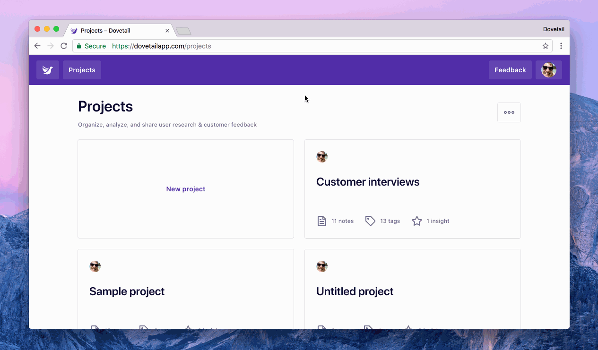

Gather valuable feedback from your users with a simple, customizable, and embeddable form. When people fill it out, their feedback is saved in your Dovetail project, ready to organize and analyze alongside everything else.

We currently offer two ways to add a feedback form to your website: An HTML iframe or a React component.

## HTML iframe

Show the iframe when a user clicks a feedback button on your website. Then, listen for a [message event](https://developer.mozilla.org/en-US/docs/Web/API/Window/postMessage) to hide the iframe when the user finishes entering their feedback and closes the dialog.

Here’s an example implementation:

<iframe height='456' scrolling='no' title='Feedback form example' src='//codepen.io/humphreybc/embed/XVzNvL/?height=300&theme-id=32200&default-tab=js,result&embed-version=2' frameborder='no' allowtransparency='true' allowfullscreen='true' style='width: 100%;'>See the Pen <a href='https://codepen.io/humphreybc/pen/XVzNvL/'>Feedback form example</a> by Benjamin Humphrey (<a href='https://codepen.io/humphreybc'>@humphreybc</a>) on <a href='https://codepen.io'>CodePen</a>.</iframe>

The form supports the following query parameters. Add these to the iframe’s src URL to pass through more data.

`collectorId` — Required. This is the form’s ID. Find this in the code snippet shown when you click **Embed** on a feedback form.

`defaultEntries` — Optional. An encoded object of key:value pairs for setting default data, e.g. prefill user’s name and email.

`metadata` — Optional. An encoded object key:value pairs for passing any custom information, e.g. browser version, local time, user license.

## React component

Using React? Setting up a feedback form is easy:

1.  Install [`@heydovetail/collector-react`](https://www.npmjs.com/package/@heydovetail/collector-react) from NPM and import it.
1.  Display the Collector component when a user clicks a button on your website. Pass through an `onDismiss` handler.
1.  Hide the Collector component in your `onDismiss` handler.

Our React component also supports setting default entries and passing through metadata. Check out [the README](https://github.com/heydovetail/collector-react) for more information.
