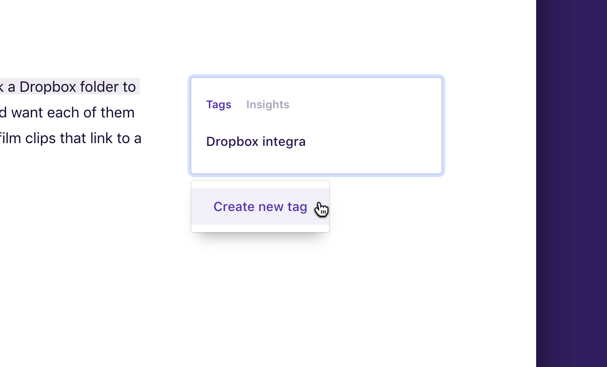
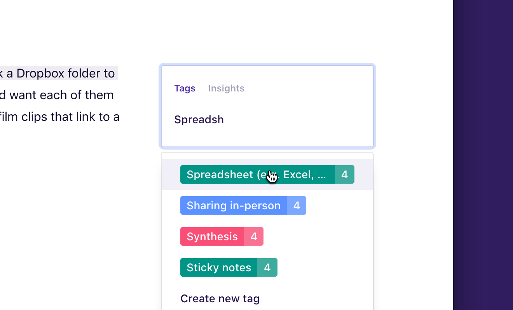
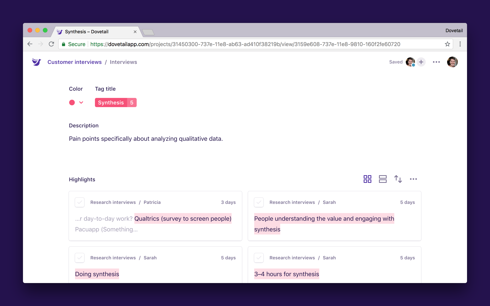

The power of Dovetail lies in inline tagging, which we call **highlighting**. There are two types of highlights: [**tags**](/help/tags) and [**insights**](/help/insights).

Highlights are added to content inside **notes**. Unlike other products, with Dovetail, you could highlight a single word, sentence, or paragraph with a tag or insight. This means you can add more granular tags or insights to content.

## What to use tags for

Tags are used to keep track of patterns that emerge across notes.

For example, let’s say you were analyzing reviews for an iPhone app. Each note in Dovetail is one review. Here’s the content of one of the reviews:

> “I love the app, however it’s becoming slower and slower. It seems to take a long time to open up initially. It’s missing a key feature – search. I need this to find what I need.”

Given this example, perhaps you’d tag _“…however it’s becoming slower and slower. It seems to take a long time to open up initially”_ with **performance** and _“It’s missing a key feature – search. I need this to find what I need”_ with **feature request**.

**Note:** New tags can either be created in-context as you highlight a note, or as a blank tag inside a project. The instructions below are for the former method.

## Create a new tag

To create a new tag in Dovetail:

1.  Open a **note**.
1.  With your mouse or keyboard, highlight the text you’d like to tag.
1.  On the right, click **Type to create** (or use the **TAB** key).
1.  Type your tag name.
1.  Click **Create new tag** (or use the **up / down arrows**).

## Add an existing tag

To add an existing tag to text in Dovetail:

1.  Open a **note**.
1.  With your mouse or keyboard, select the text you’d like to tag.
1.  On the right, click **Type to create** (or use the **TAB** key).
1.  Type the name of your existing tag.
1.  Click the existing tag (or use the **up / down arrows**).

## View all highlights for a tag

To see all highlights on a particular tag:

1.  Open a **project**.
1.  Click the **Tags** tab.
1.  Click the tag.
