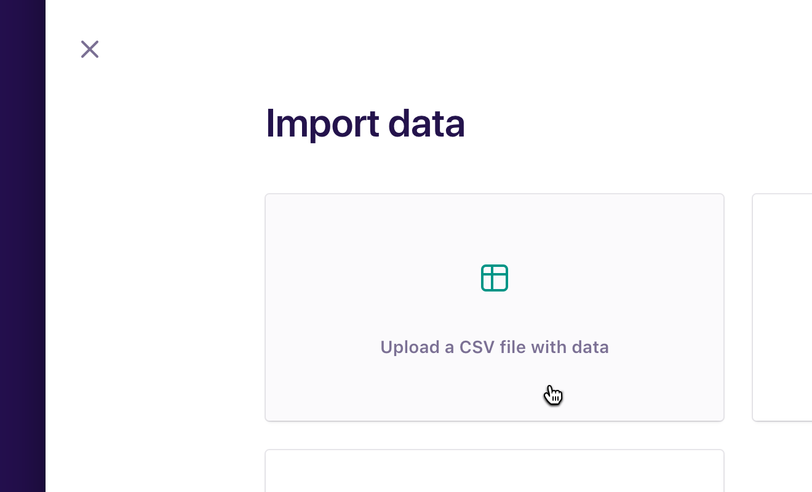

Create notes, tags, or insights in bulk from a CSV file (spreadsheet). This is handy for importing data like NPS feedback, survey responses, and customer feedback to analyze in Dovetail, or if you have an existing set of tags you’d like to import.

**Note:** CSV import is primarily designed for creating lots of small—to—medium notes. While you can import large content like interview transcripts, you’ll need to take greater care in constructing your CSV file first.

## Preparing your file for import

You’ll need a sheet from [Microsoft Excel](https://support.office.com/en-us/article/Import-or-export-text-txt-or-csv-files-5250ac4c-663c-47ce-937b-339e391393ba), [Google Sheets](<(https://support.google.com/docs/answer/49114)>), or [Numbers](https://support.apple.com/en-au/HT205391) saved as a UTF-8 encoded Comma Separated Value (CSV) file.

The first row needs to be the title of each column. For example, if you’re importing customer feedback, the first row should contain column headers with values like ‘Name’, ‘Email’, ‘Feedback’ and so on.

* Formatting like headings, bold, italics, lists, tables, and images are not supported when importing from a CSV.
* The maximum length for notes in Dovetail is 100,000 characters. No cell in your CSV file should exceed this limit.
* Dovetail will interpret two newline characters as separate paragraphs.
* Your file needs to be encoded as UTF-8 (this is usually the default).
* Your CSV file should end in a .csv file extension.

## Supported fields

You’ll need to map your CSV columns to Dovetail’s fields. When creating your CSV file, make sure it has a column for each of these:

### Title

This is an optional field. We support all UTF-8 characters, including emoji, and the limit for the title is 200 characters.

### Body

This is a required field for notes and insights, but not tags. We support all UTF-8 characters, including emoji, and the limit for the body is 100,000 characters.

### Created date

This is an optional field. We recommend the [ISO 8601](https://en.wikipedia.org/wiki/ISO_8601) date format, otherwise YYYY/MM/DD HH:MM.

## Importing your data

Once you’ve got your CSV file ready, open the project you’d like to import your data into and click **Import** near the top right.

Click **Upload a CSV file with data**:

Choose a **CSV file (.csv)** from your computer:

Decide which column to map to the note title. Open the **select menu** and choose **Title** for that column. In this case, we’ve picked the ‘author’ column:

Decide which column to map to the body. This will be the content of the note or insight. If you’re importing tags, you don’t need to select a column for body.

Open the **select menu** and choose **Body** for that column:

If you’d like to analyze the sentiment of your data, keep the **Automatically analyze sentiment** checkbox checked. Dovetail will add ‘Positive’ and ‘Negative’ tags to sentences that express a strong positive or negative sentiment. Sentiment analysis is only available on imported notes, not tags or insights.

[Learn more about sentiment analysis](/help/sentiment)

Open the **select menu** after ‘as’ and decide wheneter you’d like to import your data as notes (default), tags, or insights:

Open the next **select menu** and choose what group to put the imported data in:

Click **Import rows**. Your data will start importing. You can continue using Dovetail while this is happening; just don’t close your browser window.

Once the import has finished, **refresh** to see everything you’ve imported. In this case, the author is the note title, their review is the body, and sentiment analysis has added a few ‘Positive’ and ‘Negative’ tags for us:

