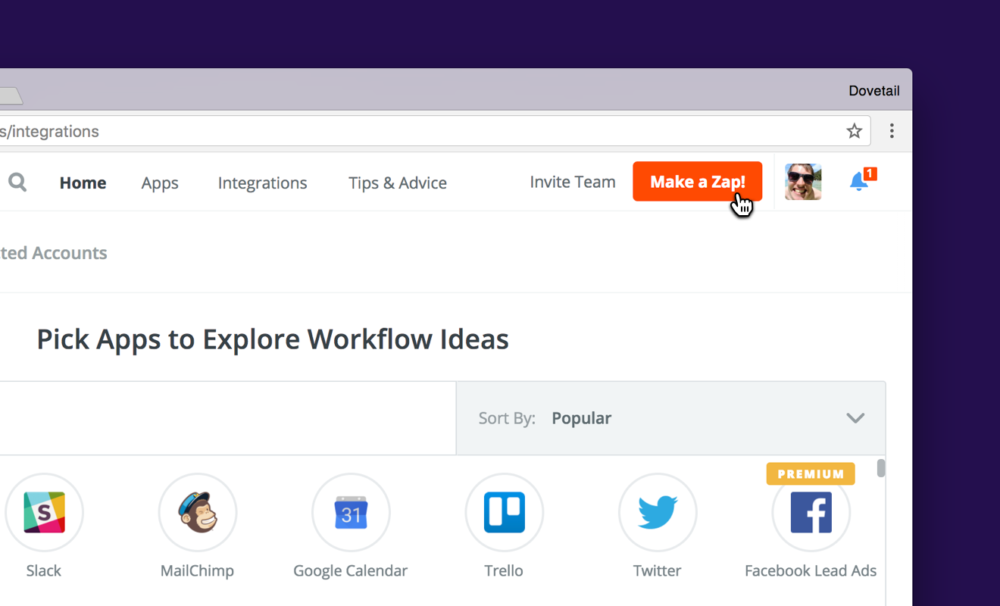
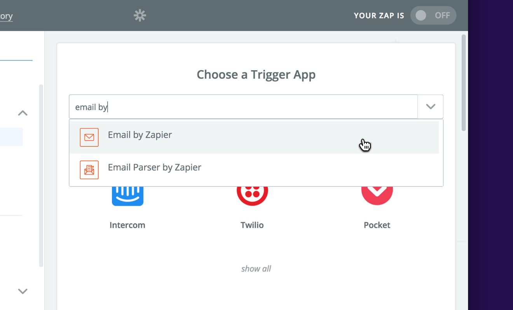
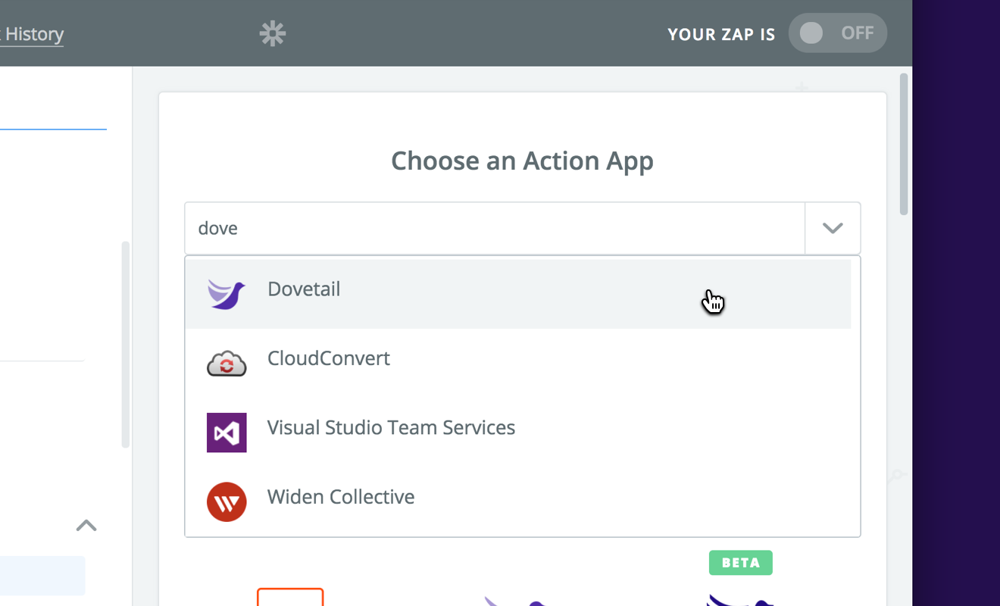
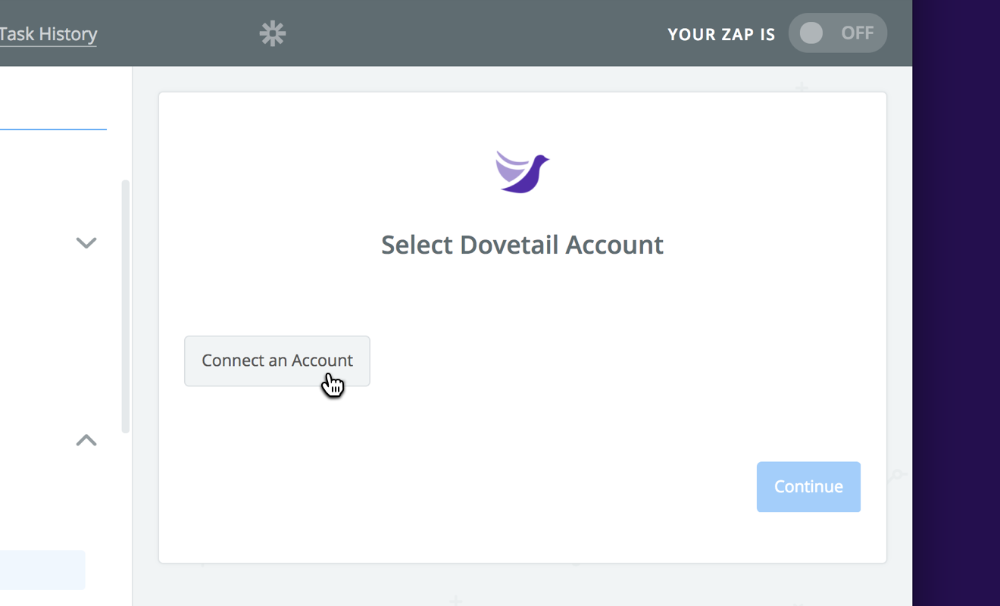
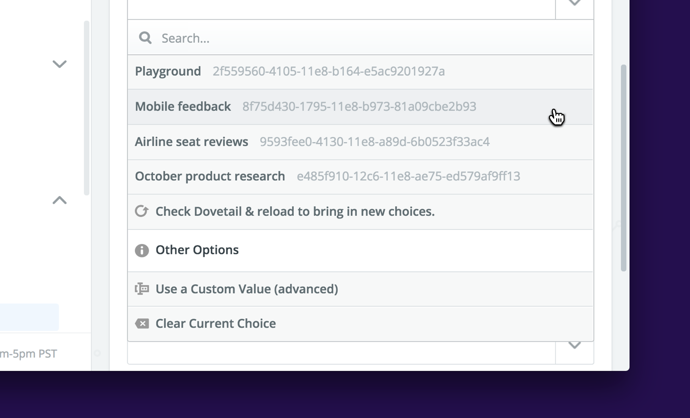
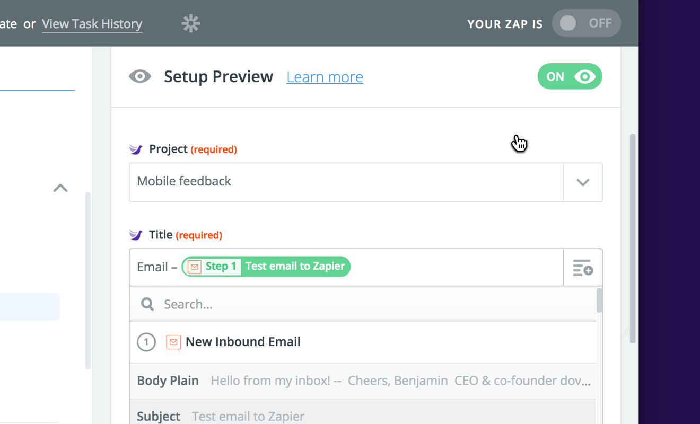
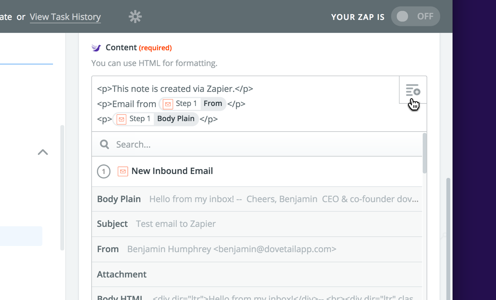
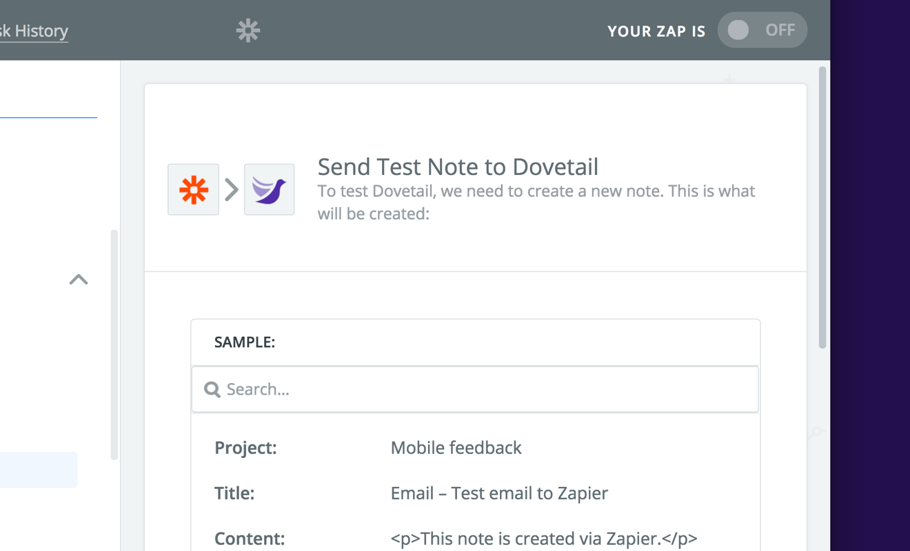
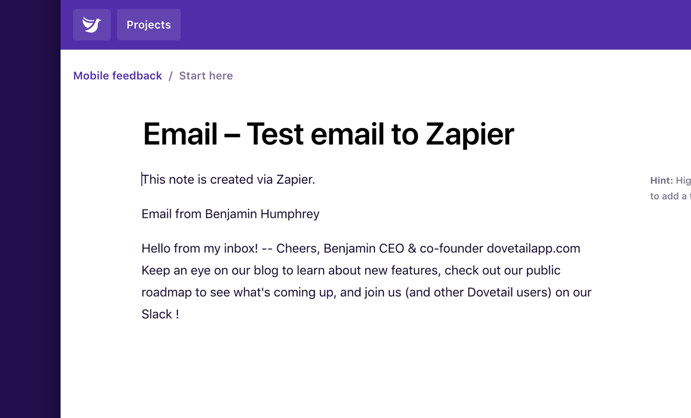

Our [Zapier](https://zapier.com/) integration lets you connect 1,000+ apps and services to Dovetail to centralize your research data and customer feedback in one place.

For example, here are some common use cases for integrations:

* **Send @mentions to Dovetail** – When you’re mentioned on Twitter, save the tweet as a new note in Dovetail.
* **Save Typeform survey responses to Dovetail** – When someone responds to a question in a Typeform survey, append their answer to a note.
* **Save Intercom conversations in Dovetail** – When a new conversation is created in Intercom, save it as a note in Dovetail.

**Note:** This example uses the **[Email to Zapier](https://zapier.com/apps/email/account/integrations)** Trigger App, however, you could choose whatever Trigger App you like from Zapier.

## Get started with Zapier

The first thing is to create a Zapier account if you don’t have one already. Sign up for free at **[zapier.com](https://zapier.com/)**, then click **Make a Zap!** in the top right corner to get started:

## Choose your trigger

Next, you’ll need to choose the **Trigger App** for your integration. This is the app you’d like to connect to Dovetail, for example Twitter, Typeform, Intercom, Google Sheets, etc.

In this example, we’re going to choose **Email by Zapier**. This Trigger App gives us a unique email address, and anything sent there will be saved as notes in Dovetail.

You’ll need to choose the ‘trigger’ for the app. This is the event that happens to trigger the integration. In our case, the trigger will be ‘New inbound email’.

## Authorize the Dovetail Trigger App

After you’ve configured the trigger, the next step is to choose the **Action App** and authorize Dovetail. You only have to authorize Dovetail once.

This time, search for **Dovetail** in the dropdown:

Now authorize Zapier to be able to create notes as you in Dovetail. Click **Connect an Account** and then click **Approve** in the popup window that appears:

Test the connection, then click **Save + Continue** to move on:

## Create your Zap Template

Now that we’ve authorized Zapier, we need to configure the **Zap Template**. This is where you can decide how you want your inbound data to look in Dovetail. In our case, the inbound data is an email sent to our Zapier email address.

First, we need to choose what **project** we’d like to add notes to. In this example, we’re going to choose a project called ‘Mobile feedback’:

Next, we need to set the **title** for notes created with this zap. You can put whatever you like in this field. In our case, we’ve put the word ‘Email’, then a hyphen, followed by the subject line of the inbound email:

After that, we need to set the note **body**. This will be the actual content of the note. This field can contain HTML – so you could create headings, paragraphs, lists, and links.

In our case, we’re going to put in a couple of paragraphs with `
` tags, and insert the **from** and **body** fields from the inbound email:

Lastly, we can choose to enable [automatic sentiment analysis](/help/sentiment) for the content in the body. If this is set to **yes**, Dovetail will automatically add the tags ‘Positive’ or ‘Negative’ when it detects positive or negative sentiment:

## Test your Zap

Once you’ve configured your template, you can test your Zap to see if it works:

If everything went okay, you should see your note created in Dovetail:

## Having problems?

[Contact us](mailto:hello@dovetailapp.com) and we’ll be happy to help.
